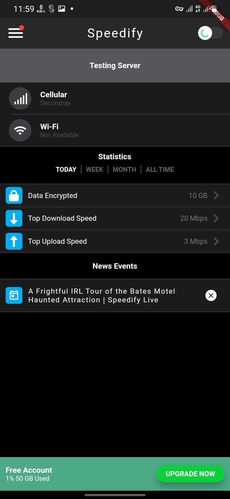
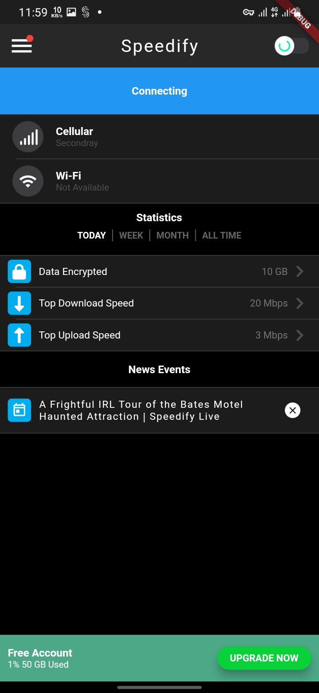
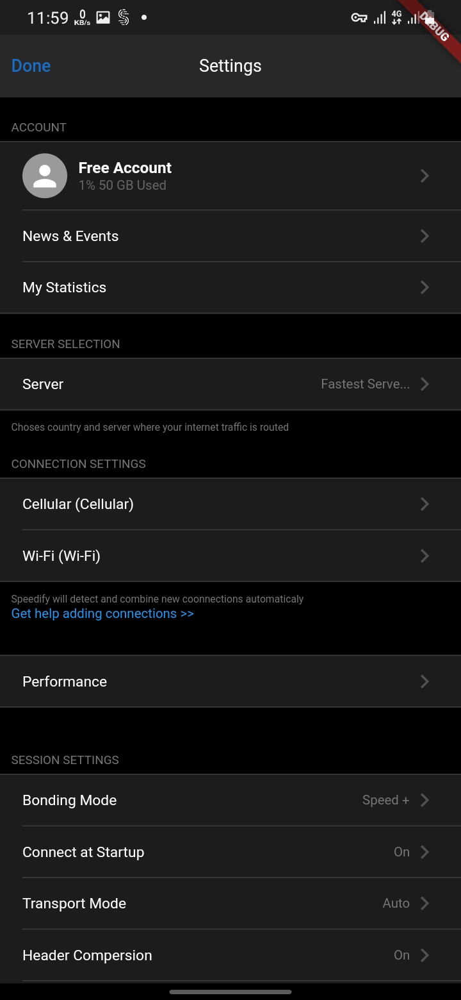
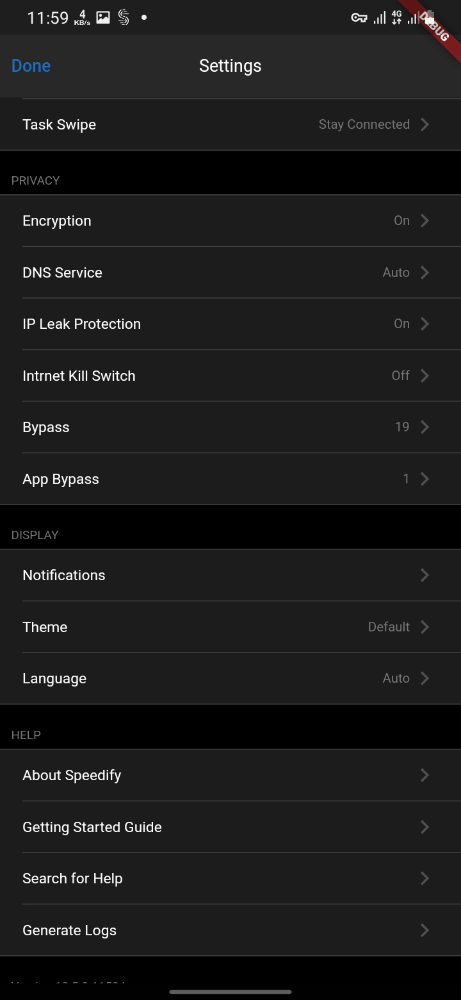
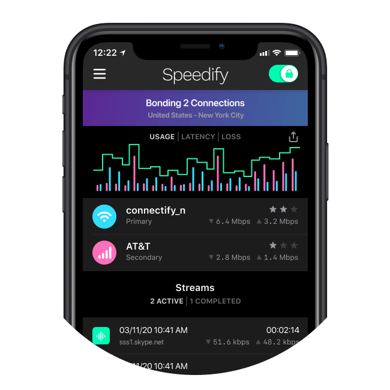

# Speedify VPN_APP UI

Vpn app concept UI done in Flutter.

## ❤️ Found this project useful?
If you found this project useful, then please consider giving it a ⭐️ on Github and sharing it with your friends via social media.

## Run the Flutter app locally
1. git clone https://github.com/IGayoub/Speedify-app-flutter.git
1. cd Speedify-app-flutter
1. `flutter pub get`
1. run `flutter doctor` make sure everything is checked
1. `flutter run` will launch the app in Device / Emulator

> The `flutter run --release` command both builds and installs the Flutter app.

# Screenshots

 |

 |

 |

 

## Created & Maintained By
[IG Ayoub](https://github.com/IGayoub) | [@ig_ayoub](https://twitter.com/ig_ayoub)

Feel free to reach out to me through [@ig_ayoub](https://twitter.com/ig_ayoub) if you have any questions or feedback! 😊
=
